# TechCorp HQ Enterprise Network Design

**Platform:** Cisco Packet Tracer  
**Devices:** Cisco 2911 Router · Cisco 3560 Multilayer Switch · Cisco 2960 Access Switches  
**Category:** Network Engineering | Enterprise Design | Cisco IOS | CCNA Level Lab  
**Author:** Marshall Kunguma  
**GitHub:** [marshnode.github.io](https://marshnode.github.io)  
**Status:** Completed ✅

---

## Overview

This project documents the full design, build, and verification of an enterprise network for a fictional company called TechCorp HQ. Starting from a blank Packet Tracer canvas, I designed the topology, cabled every device, configured every protocol, and verified end to end connectivity across all three departments.

The network isolates three business departments into separate VLANs. It enables inter department communication through a Layer 3 core switch. It uses OSPF for dynamic routing between the core and the edge router. It also gives every internal host internet access through a single public IP using NAT/PAT.

This is a CCNA level enterprise lab that mirrors real world infrastructure. Every configuration decision is documented with the reasoning behind it, not just the commands.

---

## Business Requirements

TechCorp HQ has three departments that need isolated but interconnected network segments:

| Department | VLAN | Subnet | Gateway |
|------------|------|--------|---------|
| Management | 10 | 192.168.10.0/24 | 192.168.10.1 |
| Engineering | 20 | 192.168.20.0/24 | 192.168.20.1 |
| Finance | 30 | 192.168.30.0/24 | 192.168.30.1 |
| Native/Trunk | 99 | N/A | N/A |

Each department needs to be isolated from the others at Layer 2 for security. They also need to communicate at Layer 3 for business operations. All departments need internet access routed through a single edge router.

---

## Network Topology

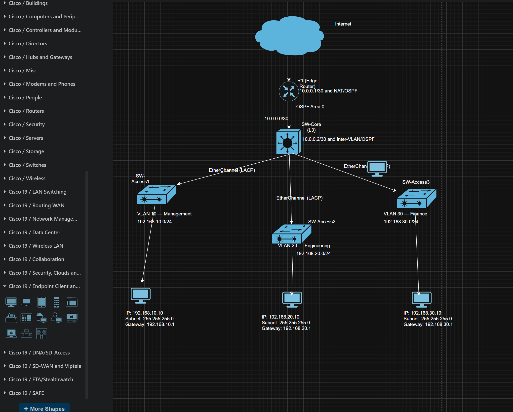

The network follows a three tier hierarchical model:

- **Edge Router (R1):** Cisco 2911. Handles NAT/PAT and OSPF routing toward the internet.
- **Core Switch (SW-Core):** Cisco 3560 multilayer switch. Handles inter VLAN routing and OSPF.
- **Access Switches (SW-Access1, SW-Access2, SW-Access3):** Cisco 2960 Layer 2 switches. Connect end devices to their VLANs.

Each access switch connects to the core switch via two physical cables. These cables are bundled into a single logical EtherChannel link using LACP for redundancy and increased bandwidth.

---

## Device Roles and IP Addressing

| Device | Interface | IP Address | Role |
|--------|-----------|------------|------|
| R1 | Gig0/0 | 10.0.0.1/30 | Link to SW-Core |
| R1 | Gig0/1 | 203.0.113.1/24 | WAN internet facing |
| SW-Core | Fa0/7 | 10.0.0.2/30 | Routed uplink to R1 |
| SW-Core | VLAN 10 SVI | 192.168.10.1/24 | Default gateway for Management |
| SW-Core | VLAN 20 SVI | 192.168.20.1/24 | Default gateway for Engineering |
| SW-Core | VLAN 30 SVI | 192.168.30.1/24 | Default gateway for Finance |
| PC0 | Fa0 | 192.168.10.10/24 | Management department host |
| PC1 | Fa0 | 192.168.20.10/24 | Engineering department host |
| PC2 | Fa0 | 192.168.30.10/24 | Finance department host |

---

## Stage 1: VLAN Creation

### What I Did
I created four VLANs on every switch in the network. Three VLANs were created for the business departments. One dedicated native VLAN was also created. The VLANs were named Management (10), Engineering (20), Finance (30), and Native (99). This was done on SW-Core and all three access switches.

### Why It Matters
Without VLANs, every device on every switch shares the same broadcast domain. Every ARP request, every DHCP broadcast, and every announcement from any device goes to every other device on the network. In a company environment this creates unnecessary traffic. It also degrades performance and creates security risks. Finance traffic would be visible to Engineering devices.

VLANs solve this by creating logical segments. A PC in the Management VLAN only sees broadcasts from other Management devices. Traffic is contained within each department at Layer 2.

VLAN 99 was created as a dedicated native VLAN. The native VLAN carries untagged frames on trunk links. Best practice is to move this away from the default VLAN 1. Leaving it on VLAN 1 is a well known security vulnerability that can be exploited through VLAN hopping attacks.

### Screenshot: VLAN Brief on SW-Core
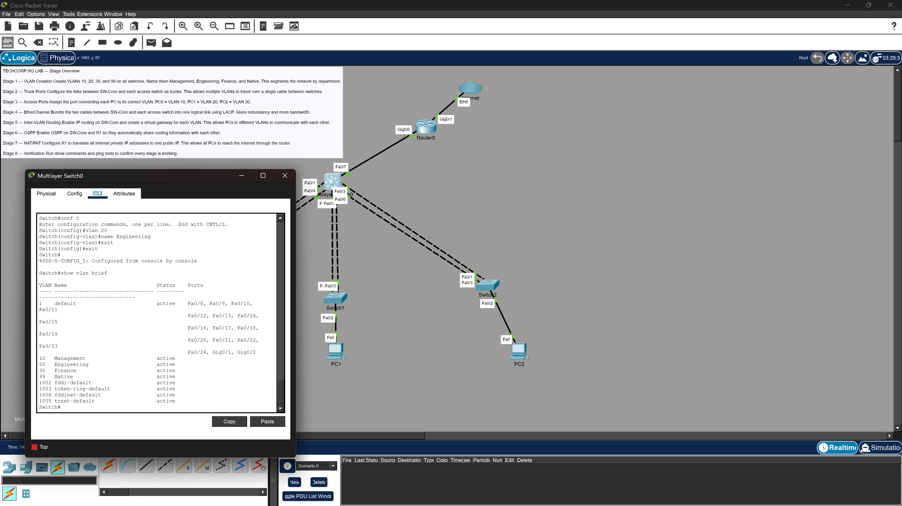

### Screenshot: VLAN Brief on Switch1
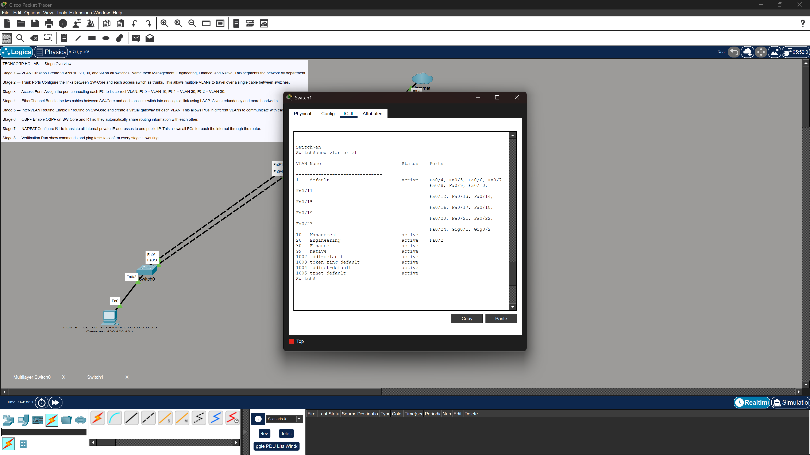

### Screenshot: VLAN Brief on Switch2

---

## Stage 2: Trunk Ports

### What I Did
I configured the uplink ports between SW-Core and each access switch as 802.1Q trunk ports. This was done on both ends of every link. It was applied on SW-Core's downlinks and on each access switch's uplink ports. Every trunk port was configured to allow VLANs 10, 20, 30, and 99. The native VLAN was set to 99 on all trunk ports.

### Why It Matters
A standard access port carries traffic for only one VLAN. If the links between SW-Core and the access switches were left as access ports, only one VLAN's traffic could pass through. This would completely defeat the purpose of having multiple VLANs.

Trunk ports solve this using 802.1Q tagging. As a frame crosses a trunk link, the switch inserts a 4 byte VLAN tag into the Ethernet header. This tag identifies which VLAN the frame belongs to. The receiving switch reads the tag and forwards the frame into the correct VLAN. This allows all three department VLANs to share a single physical cable between switches.

Both ends of a trunk must agree on the native VLAN. During this stage I encountered native VLAN mismatch errors. The error was `%CDP-4-NATIVE_VLAN_MISMATCH`. This happened because the access switches still had the default native VLAN 1 while SW-Core was configured for VLAN 99. The fix was to apply native VLAN 99 on the access switch uplinks as well. Trunk configuration is always a two sided commitment.

### Screenshot: Native VLAN Mismatch Error
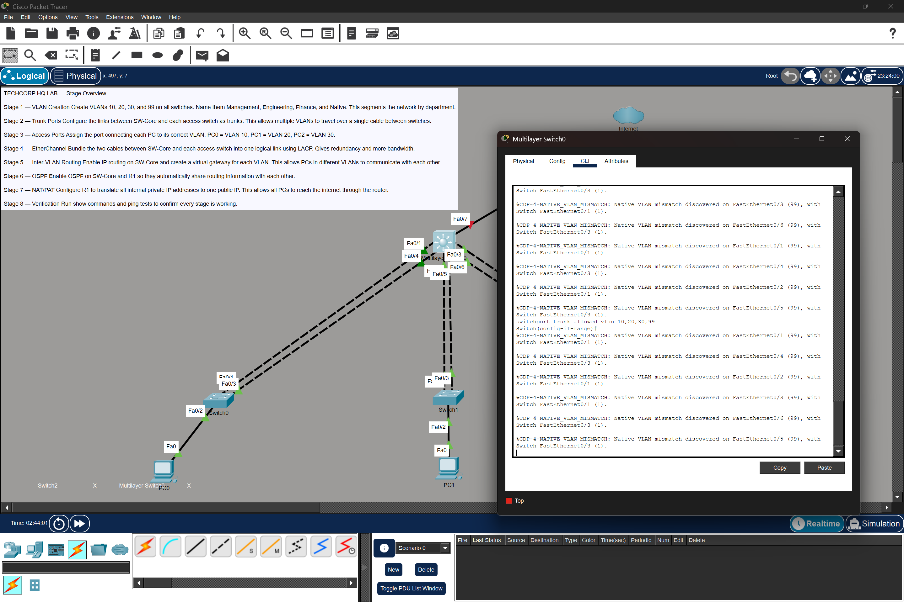

### Screenshot: Trunk Port Status on SW-Core
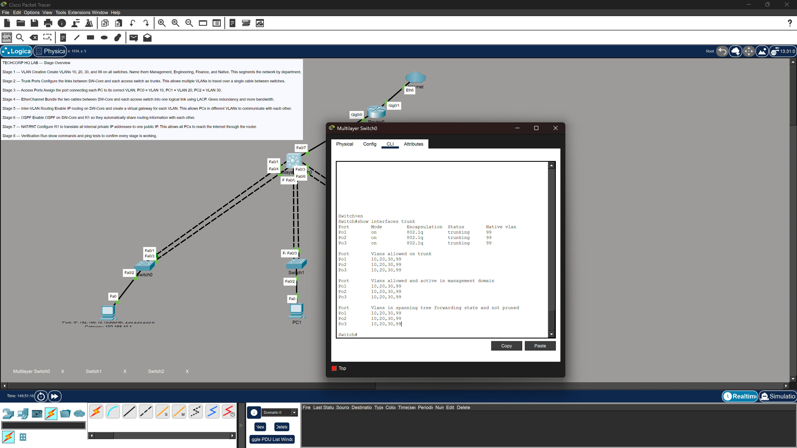

---

## Stage 3: Access Port Assignment

### What I Did
I assigned the PC facing port on each access switch to its correct department VLAN. PC0 on Switch0 was assigned to VLAN 10. PC1 on Switch1 was assigned to VLAN 20. PC2 on Switch2 was assigned to VLAN 30. Each access port was configured as a non trunk port belonging to exactly one VLAN.

### Why It Matters
Access ports connect end devices to the network. This includes PCs, printers, and phones. Unlike trunk ports that carry multiple VLANs, an access port belongs to exactly one VLAN. When a frame arrives on an access port, the switch stamps it with that port's VLAN membership. It then forwards the frame accordingly.

Without this step, the PCs would sit on VLAN 1 by default. They would have no connectivity to the correct department subnets. This step is what actually places each end device into its logical network segment.

### Screenshot: Access Port Assignment on Switch0
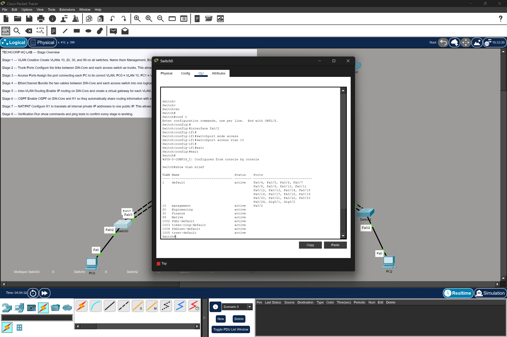

---

## Stage 4: EtherChannel (LACP)

### What I Did
I bundled the two physical cables between SW-Core and each access switch into single logical port channel interfaces using LACP. Both sides of every EtherChannel bundle were set to active mode. This means both ends actively negotiate the bundle. This created three port channel interfaces:

- Port channel 1 connects SW-Core to Switch0
- Port channel 2 connects SW-Core to Switch1
- Port channel 3 connects SW-Core to Switch2

Each port channel was then configured as a trunk carrying VLANs 10, 20, 30, and 99 with native VLAN 99.

### Why It Matters
Having two separate physical links between switches without EtherChannel creates a problem. Spanning Tree Protocol would detect a loop and block one of the links to prevent broadcast storms. The result is that one cable sits completely idle. It provides no bandwidth benefit and no active redundancy.

EtherChannel solves both problems at once. STP sees the bundle as a single logical link and does not block it. Both physical cables actively carry traffic. This effectively doubles the available bandwidth between switches. If one cable fails, the other continues carrying traffic with no downtime and no reconvergence needed.

LACP was chosen because it is the open standard protocol defined in IEEE 802.3ad. It works across multi vendor environments unlike Cisco's proprietary PAgP.

### Troubleshooting EtherChannel
This stage required the most troubleshooting in the entire lab. Several issues were encountered and resolved.

**VLAN mask mismatch:** Ports were added to channel groups before trunk configuration was applied to the physical interfaces. This caused the `CANNOT_BUNDLE2` error. The fix was to configure trunk encapsulation and allowed VLANs directly on the physical interfaces first, then assign them to the channel group.

**Suspended ports:** Multiple attempts resulted in ports showing the suspended flag. The root cause was configuration applied to only one side of the bundle. LACP requires both sides to be active at the same time.

**Administratively disabled ports:** Some physical interfaces on SW-Core were in a shutdown state. Running `no shutdown` on Fa0/1 and Fa0/4 resolved the issue for Port channel 1.

### Screenshot: EtherChannel Summary During Troubleshooting
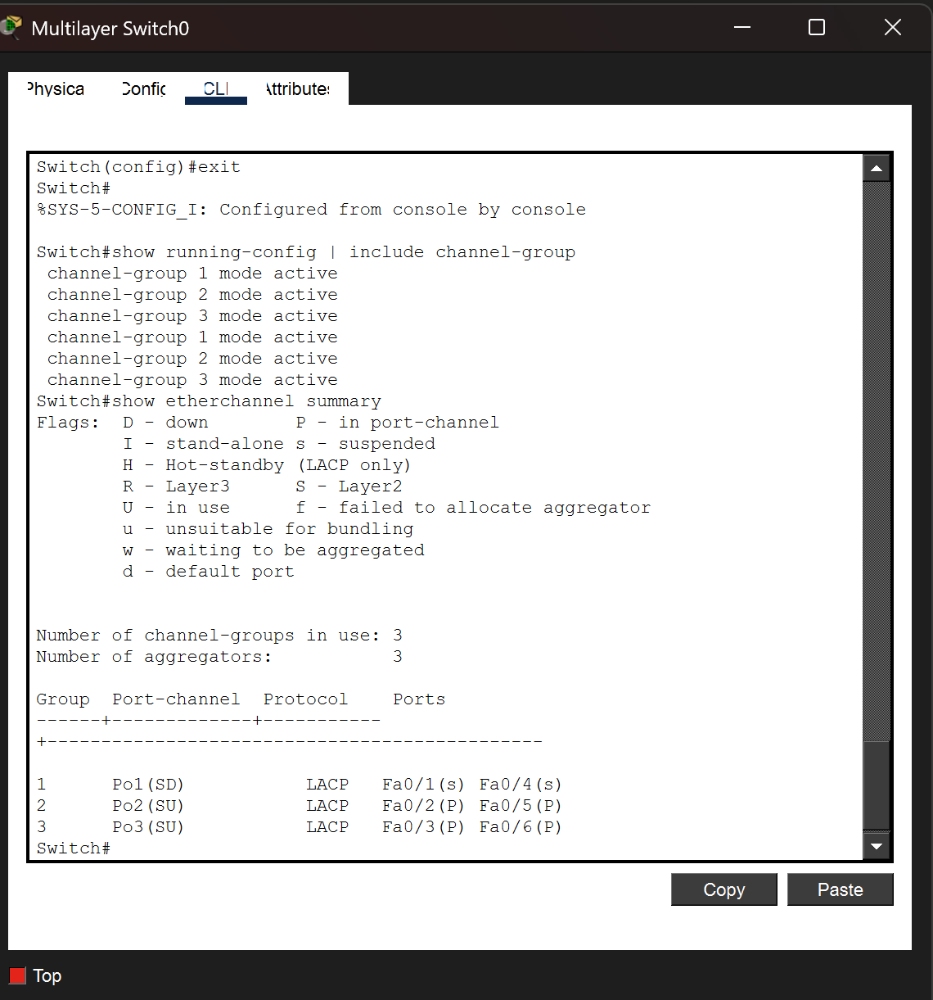

### Screenshot: EtherChannel Summary After Full Resolution
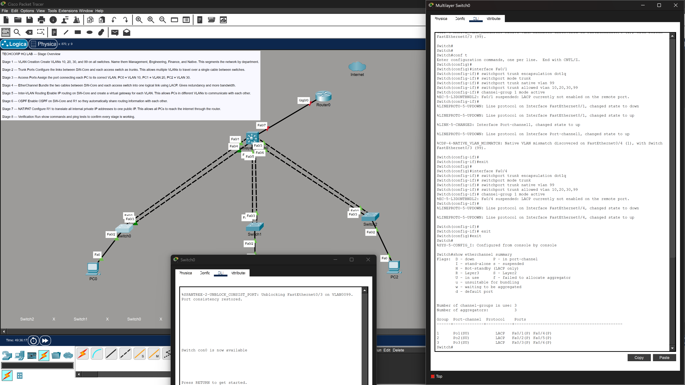

All three port channels show **SU** meaning Layer 2 and in use. All member ports show **P** meaning bundled. This confirms successful LACP negotiation across all three bundles.

---

## Stage 5: Inter VLAN Routing

### What I Did
I enabled IP routing on SW-Core and created Switched Virtual Interfaces for each VLAN. One SVI was created per department. Each SVI was assigned the gateway IP address for its VLAN and brought up with no shutdown. Static IP addresses were then assigned to each PC with their respective SVI as the default gateway.

PC0 was assigned 192.168.10.10 with gateway 192.168.10.1  
PC1 was assigned 192.168.20.10 with gateway 192.168.20.1  
PC2 was assigned 192.168.30.10 with gateway 192.168.30.1

### Why It Matters
VLANs are isolated by design. That is the whole point of creating them. A PC in VLAN 10 cannot natively send traffic to a PC in VLAN 20. They are in different broadcast domains and different IP subnets. Without inter VLAN routing, the Finance team could not communicate with Engineering. Management could reach no one outside its own VLAN.

SVIs are virtual Layer 3 interfaces that exist inside the multilayer switch. One is created per VLAN. When a PC sends traffic destined for another VLAN, it forwards the packet to its default gateway which is the SVI. SW-Core receives the packet and looks up the destination subnet in its routing table. It then forwards the packet into the correct VLAN. All of this happens inside the switch at hardware speed. This approach is called Layer 3 switching and it is far more efficient than the older router on a stick method.

### Screenshot: SVI Configuration on SW-Core
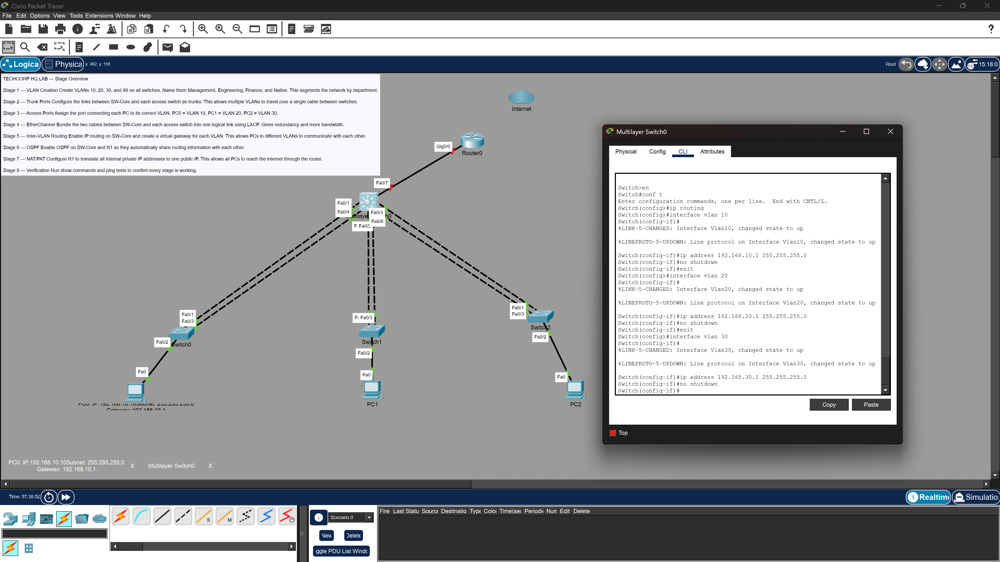

### Screenshot: PC0 IP Configuration

### Screenshot: Inter VLAN Ping Test from PC0
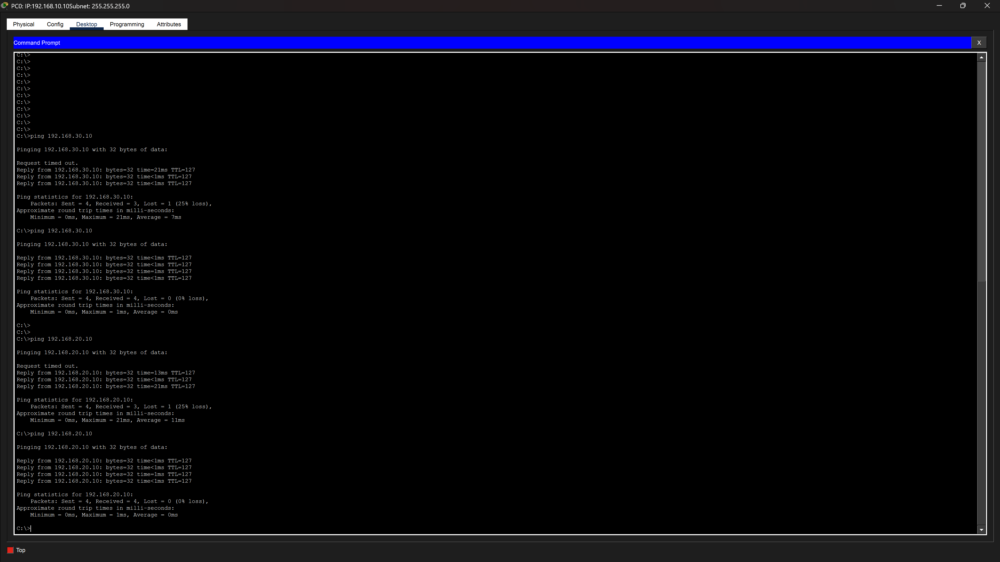

Successful pings between all PCs across different VLANs confirm that inter VLAN routing is working correctly.

---

## Stage 6: OSPF Dynamic Routing

### What I Did
I configured a routed point to point link between SW-Core and R1 using the /30 subnet 10.0.0.0/30. SW-Core's Fa0/7 was converted from a switchport to a routed interface. Both devices were then configured with OSPF process 1 in Area 0. R1 was configured to advertise a default route to SW-Core using `default-information originate`.

### Why It Matters
Without a routing protocol, SW-Core and R1 would only know about their directly connected networks. SW-Core would have no path to the internet. R1 would have no knowledge of the three VLAN subnets behind SW-Core. Static routes could solve this but they do not scale. Every new subnet would require a manual update on every router in the network.

OSPF is a link state dynamic routing protocol. When R1 and SW-Core form an OSPF neighbor relationship, they automatically exchange their routing tables. R1 learns about all three VLAN subnets from SW-Core. SW-Core learns the default route from R1. This tells SW-Core to send all unknown traffic toward the internet via R1.

A /30 subnet was used for the point to point link between SW-Core and R1. It provides exactly two usable host addresses. One address goes to each endpoint with no wasted address space. This is standard practice for router to router links in enterprise networks.

### Screenshot: OSPF Configuration on SW-Core
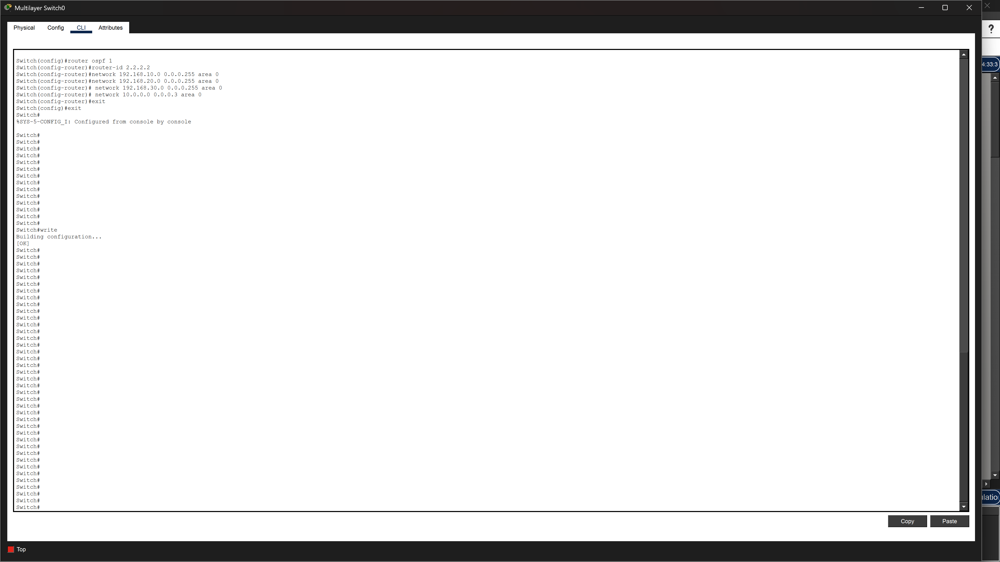

### Screenshot: OSPF Configuration on R1
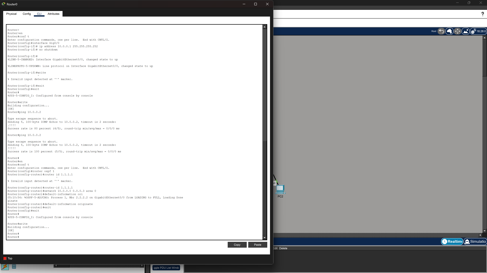

### Screenshot: OSPF Neighbor Adjacency
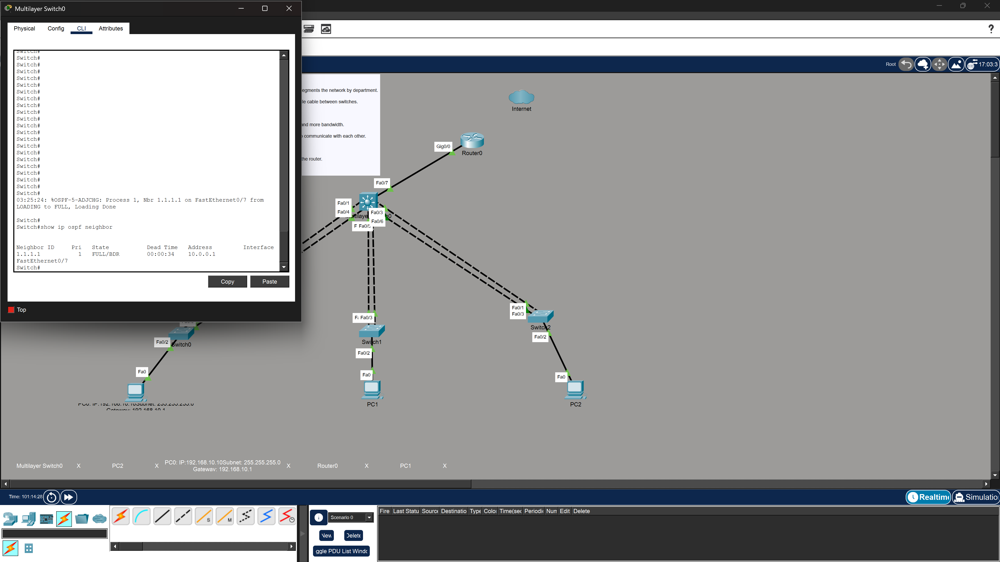

### Screenshot: Routing Table on SW-Core

### Screenshot: Routing Table on R1

Key confirmations:
- OSPF neighbor state **FULL** between R1 and SW-Core ✅
- R1 routing table shows all three VLAN subnets learned via OSPF ✅
- SW-Core routing table shows O*E2 default route learned from R1 ✅
- Gateway of last resort set to 10.0.0.1 on SW-Core ✅

---

## Stage 7: NAT and PAT

### What I Did
I configured Port Address Translation on R1 to allow all internal hosts across all three VLANs to reach the internet using R1's single public IP address of 203.0.113.1. R1's WAN interface was assigned the public IP and pointed to a simulated ISP gateway. A standard access control list was created to define the internal networks eligible for translation. NAT overload was applied to the WAN interface. Both interfaces were tagged as inside and outside.

### Why It Matters
The three VLAN subnets use private IP address space from RFC 1918. These are the 192.168.x.x ranges. These addresses are not routable on the public internet. An ISP will drop any packet arriving with a private source address.

NAT solves this by translating private source addresses to the router's public IP as packets leave the network. R1 tracks each active connection in a translation table. It maps the internal host's private IP and port number to the public IP and a unique port number. When return traffic arrives from the internet, R1 looks up the translation and forwards it to the correct internal host.

PAT extends basic NAT by using port numbers to differentiate between thousands of simultaneous connections from different internal hosts. All of these connections share the same single public IP. This is exactly how home routers and corporate gateways work in the real world.

### Screenshot: R1 NAT and WAN Interface Configuration
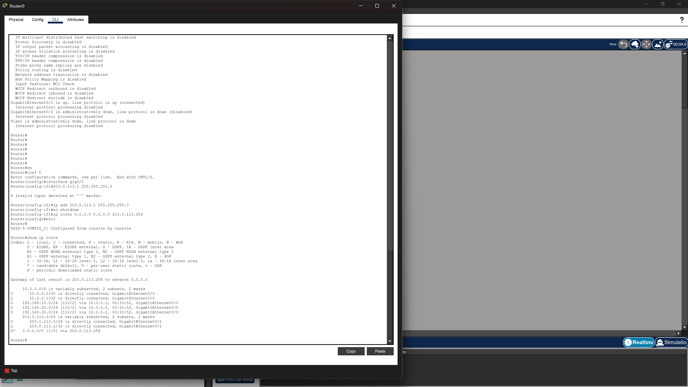

### Screenshot: PC0 Pinging the Internet
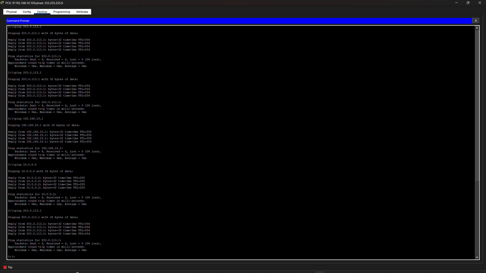

Successful pings from PC0 to 203.0.113.1 with **TTL=254** confirms NAT translation is occurring. The TTL value decreased by exactly one hop. This is proof that traffic passed through R1 and was translated before reaching the destination.

---

## Stage 8: Final Verification

### Full Connectivity Matrix

| Source | Destination | Result |
|--------|-------------|--------|
| PC0 (192.168.10.10) | PC1 (192.168.20.10) | ✅ Success |
| PC0 (192.168.10.10) | PC2 (192.168.30.10) | ✅ Success |
| PC0 | VLAN 10 Gateway (192.168.10.1) | ✅ Success |
| PC0 | SW-Core uplink (10.0.0.2) | ✅ Success |
| PC0 | R1 LAN interface (10.0.0.1) | ✅ Success |
| PC0 | Internet (203.0.113.1) | ✅ Success |
| R1 | SW-Core (10.0.0.2) | ✅ Success |
| OSPF | R1 and SW-Core Adjacency | ✅ FULL |
| EtherChannel | Po1, Po2, Po3 | ✅ SU and P |

---

## Troubleshooting Summary

This lab involved real troubleshooting at multiple stages. It was not a clean first run. Below is an honest account of every issue encountered and how it was resolved.

**Native VLAN Mismatch**
CDP warnings appeared on SW-Core showing native VLAN mismatch on all trunk links. The root cause was that access switch uplink ports defaulted to native VLAN 1. SW-Core was already configured for VLAN 99. The fix was to apply native VLAN 99 on all access switch uplink ports. Trunk configuration must be symmetric on both ends.

**EtherChannel VLAN Mask Mismatch**
Port channel bundles showed the `CANNOT_BUNDLE2` error. This happened because physical interfaces were added to channel groups before trunk configuration was applied. The fix was to configure trunk encapsulation and allowed VLANs directly on physical interfaces first. The port channel interface inherits configuration from its member ports, not the other way around.

**LACP Not Negotiating**
Ports showed the suspended and independent flags when only one side of an EtherChannel bundle was configured at a time. LACP times out waiting for the remote end. The fix was to configure both sides in quick succession so LACP could complete negotiation.

**Administratively Disabled Interface**
Fa0/1 and Fa0/4 on SW-Core were shut down. This caused Port channel 1 to remain down even after full configuration. The `show interfaces fa0/1` command revealed the line protocol was down and disabled. The fix was running `no shutdown` on both interfaces.

**OSPF Default Route Not Propagating**
SW-Core initially showed gateway of last resort is not set even after OSPF was configured. The root cause was that R1 had no default route to advertise. The `default-information originate` command only advertises a default route if R1 itself has one. The fix was adding a static default route on R1 pointing toward the ISP gateway. R1 then successfully advertised it to SW-Core via OSPF.

---

## Skills Demonstrated

- Enterprise network topology design using Draw.io
- VLAN segmentation and 802.1Q trunking
- Access port assignment and VLAN membership
- EtherChannel link aggregation using LACP
- Layer 3 inter VLAN routing using SVIs on a multilayer switch
- OSPF dynamic routing including neighbor adjacency and default route propagation
- NAT/PAT configuration for internet access from private address space
- Point to point link design using /30 subnets
- Systematic multi stage troubleshooting using Cisco IOS show commands
- Cisco IOS CLI proficiency across routers and multilayer switches
- Packet Tracer network simulation

---

## Tools Used

| Tool | Purpose |
|------|---------|
| Cisco Packet Tracer | Network simulation and CLI configuration |
| Draw.io | Network topology diagram |
| Cisco IOS | Router and switch operating system |
| GitHub | Documentation and portfolio hosting |

---

## References

- [Cisco CCNA Certification](https://www.cisco.com/c/en/us/training-events/training-certifications/certifications/associate/ccna.html)
- [IEEE 802.3ad LACP Standard](https://www.ieee802.org/3/ad/)
- [Cisco OSPF Configuration Guide](https://www.cisco.com/c/en/us/td/docs/ios-xml/ios/iproute_ospf/configuration/xe-16/iro-xe-16-book.html)
- [RFC 1918 Private Address Space](https://tools.ietf.org/html/rfc1918)
- [RFC 3022 Traditional IP NAT](https://tools.ietf.org/html/rfc3022)
- [Cisco EtherChannel Configuration Guide](https://www.cisco.com/c/en/us/support/docs/lan-switching/etherchannel/12023-4.html)
